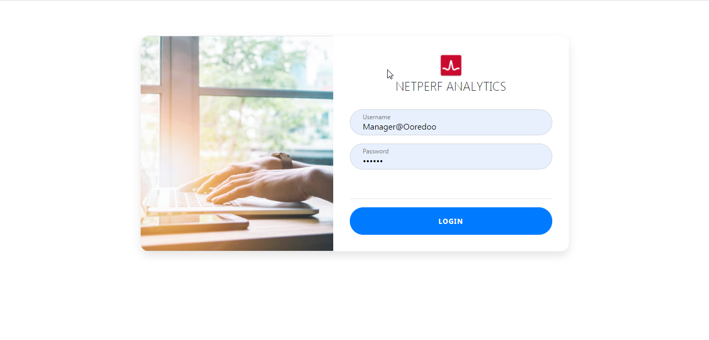
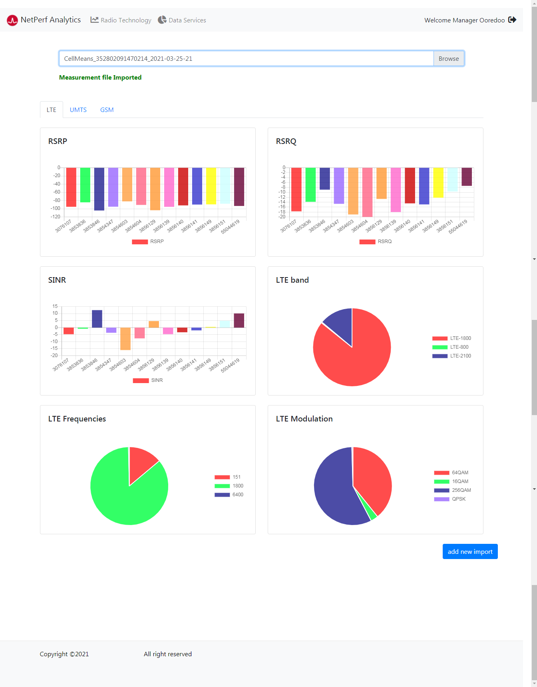
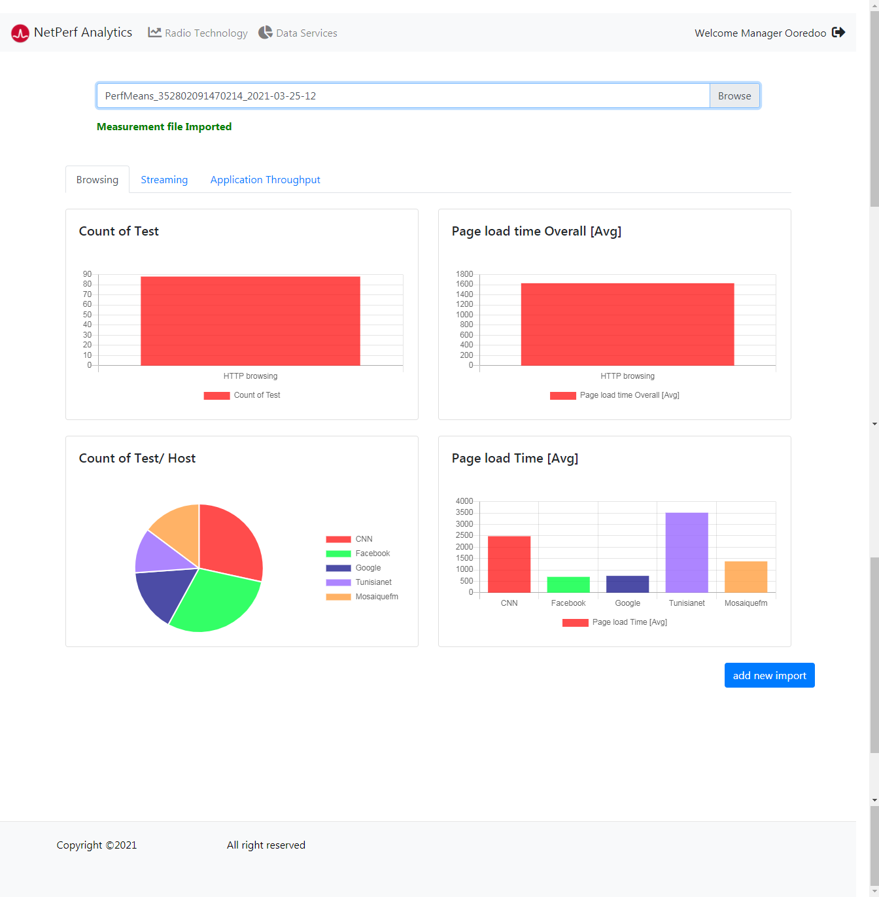

## Project Name

Netperf Analysis

An application used to analyse measurement files générated by the mobile application.

## Project Status

This project is currently in development.

## Project Screen Shot(s)
#### 1- Login page :



#### 2- Radio technology parameters analysis :

 

#### 3- Data services KPI analysis:




## Installation and Setup Instructions

Clone down this repository. You will need node and npm installed globally on your machine.

### Installation:

```bash
npm install

```

### To Start Server:

```bash
npm start
```

### To Visit App:

```bash
localhost:3000/login
```